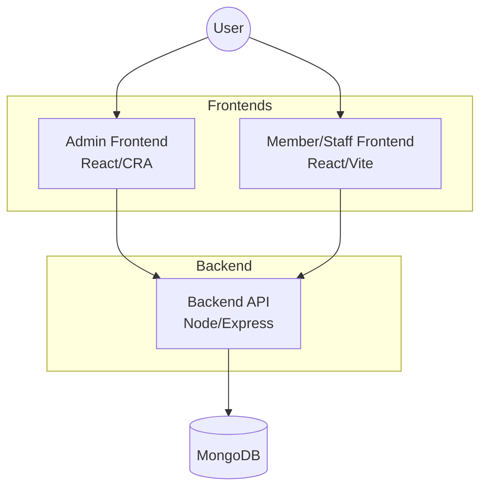
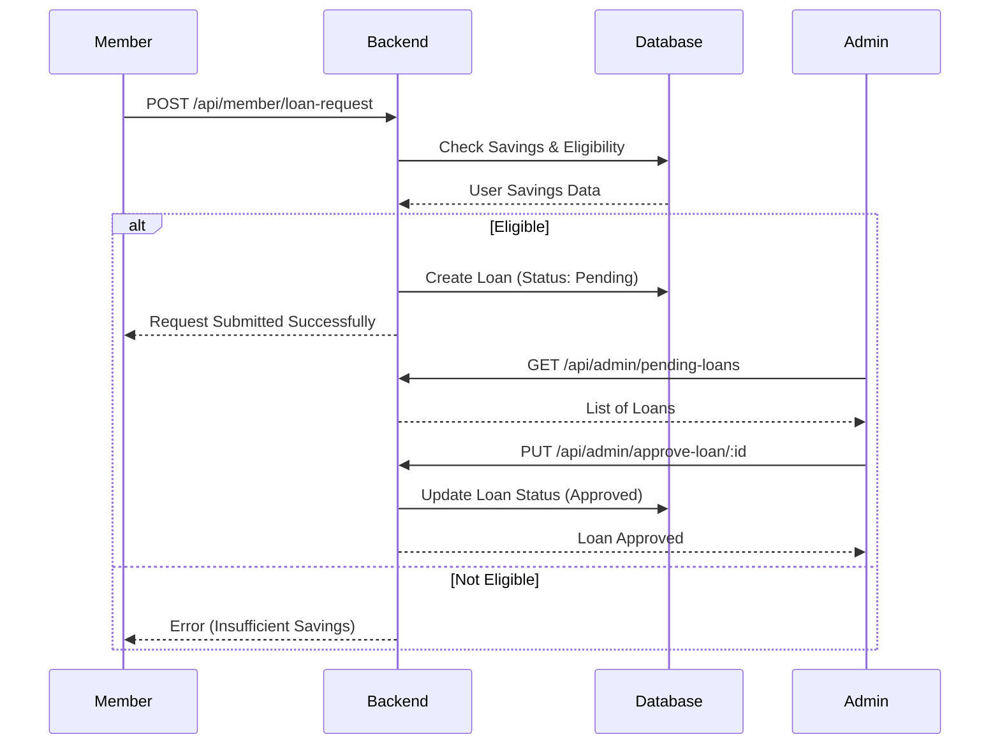
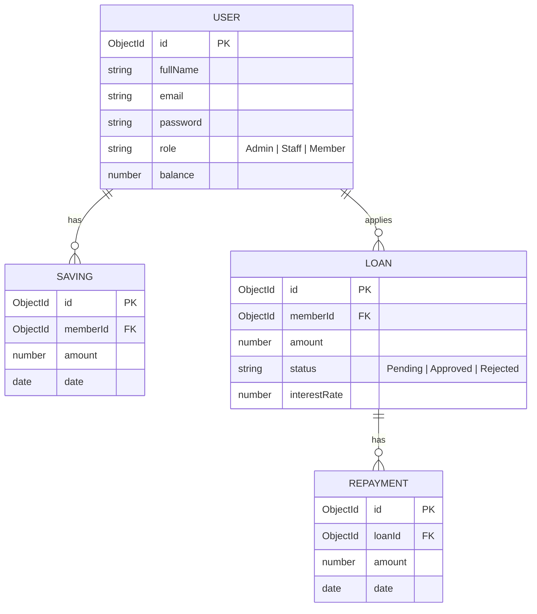

# Harari Saving and Credit Management System (HCSMS) 🏦

A comprehensive web-based application designed to digitize and automate the operations of a saving and credit cooperative. HCSMS replaces manual, paper-based record-keeping with a centralized, secure, and efficient digital system.

---

## 🌟 Overview

The Harari Saving and Credit Management System aims to streamline the management of members, savings, loans, and repayments. By moving away from manual processes, the system ensures data accuracy, transparency, and operational efficiency.

### 🚩 Problem Statement
Manual systems often suffer from:
- **Data Redundancy & Errors:** Manual entries lead to mistakes and duplicate records.
- **Slow Processing:** Calculating interest, checking eligibility, and generating reports is time-consuming.
- **Lack of Transparency:** Members cannot easily check their balances or loan status.
- **Security Risks:** Physical files are vulnerable to loss, damage, or unauthorized access.

### 💡 The Solution
HCSMS solves these issues through:
- **Automation:** Instant calculation of interest and loan eligibility.
- **Centralized Database:** Secure storage in a single location to prevent duplicates.
- **Real-time Access:** Up-to-date information for both members and staff.
- **Security:** Robust digital authentication and role-based access control (RBAC).

---

## 🏗 System Architecture



---

## 👥 User Roles & Responsibilities

The system caters to three primary user types:

### 1. Admin (System Administrator & Manager)
- Manage system settings and interest rates.
- Manage staff and users.
- Approve or reject loan requests.
- View comprehensive financial reports and audit logs.

### 2. Staff (Cashier/Officer)
- Register new members.
- Record daily savings deposits.
- Record loan repayments.
- Assist members with in-office transactions.

### 3. Member (Beneficiary)
- View personal profile and savings history.
- Check loan status.
- Apply for new loans online.

---

## 🚀 Key Functionalities

- **Member Registration:** Streamlined onboarding of new cooperative members.
- **Saving Deposit:** Quick recording and tracking of member savings.
- **Loan Management:** Complete lifecycle from application to eligibility checks, approval, and repayment tracking.
- **Eligibility Check:** Automated validation (e.g., `Requested Amount <= Total Savings * Multiplier`).
- **Report Generation:** Instant summaries of total savings, active loans, and overdue payments.
- **Authentication & Authorization:** Secure JWT-based login and role-restricted access.

### Core Workflow: Loan Application


---

## 🛠 Tech Stack

HCSMS is built using the **MERN** stack for high performance and scalability.

- **Frontend:** [React.js](https://reactjs.org/)
- **Backend:** [Node.js](https://nodejs.org/) & [Express.js](https://expressjs.com/)
- **Database:** [MongoDB](https://www.mongodb.com/) (NoSQL via Mongoose)
- **Authentication:** JWT & Bcrypt
- **Styling:** Vanilla CSS / Tailwind CSS

---

## 📂 Project Structure

```text
ip_project/
├── admin_fontend/          # React App (CRA) for Admin Panel
├── member_staff_frontend/   # React App (Vite) for Staff & Members
├── backend/                 # Node.js/Express API Server
└── README.md                # Project Documentation
```

---

## 📋 Database Schema



---

## ⚙️ Setup & Installation

### 1. Prerequisites
- Node.js (v14+)
- MongoDB (Local or Atlas)

### 2. Environment Configuration

#### Backend (`/backend/.env`)
```env
PORT=5000
MONGO_URI=your_mongodb_uri
JWT_SECRET=your_jwt_secret
JWT_EXPIRES_IN=7d
SYSTEM_MULTIPLIER=3
SEED_ADMIN_EMAIL=admin@harari.local
SEED_ADMIN_PASSWORD=AdminPass123
```

#### Admin Frontend (`/admin_fontend/.env`)
```env
REACT_APP_API_URL=http://localhost:5000/api
```

### 3. Installation Steps

1. **Clone the repository:**
   ```bash
   git clone <repository-url>
   cd ip_project
   ```

2. **Backend Setup:**
   ```bash
   cd backend
   npm install
   npm run dev
   ```

3. **Admin Frontend Setup:**
   ```bash
   cd ../admin_fontend
   npm install
   npm start
   ```

4. **Member/Staff Frontend Setup:**
   ```bash
   cd ../member_staff_frontend
   npm install
   npm run dev
   ```

---

## 🛡 Security Features
- **JWT Authentication:** Secure identity verification.
- **RBAC:** Role-Based Access Control.
- **Input Validation:** Server-side validation for all requests.
- **Password Hashing:** Bcrypt encryption for user credentials.
